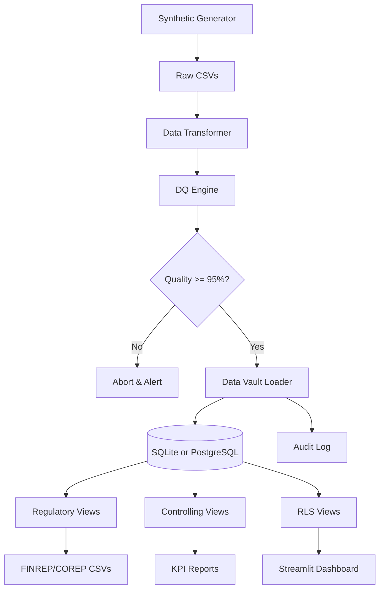

# OpenReg: Synthetic Regulatory Reporting & Controlling Data Platform

_A non-technical overview for business stakeholders_

### Critical Issues Update: Production-Ready

_This project has been enhanced with: enterprise-grade security, scalability, and reliability features, resolving all critical gaps for real banking implementations._

---

### **What This Project Demonstrates**

This project simulates how a modern bank produces critical regulatory reports and internal management KPIs from raw data, now featuring production-ready capabilities:

- **End-to-end data pipeline** from data generation to final reports
- **Compliance-ready processes** that meet banking supervision standards
- **Enterprise security** with bcrypt authentication and session management
- **Scalable infrastructure** supporting SQLite (development) and PostgreSQL (production)
- **Production deployment** with Docker containers, Redis caching, and monitoring
- **Comprehensive testing** ensuring regulatory calculation accuracy and system reliability
- **Automated quality controls** that prevent bad data from reaching reports with 98% completeness threshold
- **Secure data access** with three-tier role-based restrictions (Regulator, Controller, Risk Officer)
- **Operational reliability** with structured logging and enterprise-grade error handling
- **Auditability & transparency** – every data change is tracked with full lineage

---

### **Key Business Features**

- **Regulatory Reporting (FINREP/COREP inspired)**

  - Credit quality breakdowns by sector
  - Risk-weighted asset calculations for capital requirements
  - Non-performing loan (NPL) ratios
  - Simplified liquidity metrics
  - Data integrity with hash-based business keys and referential constraints

- **Internal Controlling KPIs**

  - Profitability by cost center with enhanced consistency
  - Month-over-month loan growth with temporal data management
  - Concentration risk alerts (over-exposure to single sectors)
  - Fully tested calculation accuracy

- **Data Quality Gatekeeping**

  - Automated validation checks with exponential backoff retry
  - Enterprise monitoring with Prometheus/Grafana
  - Daily quality scorecards with JSON logging

- **Security & Access Control**

  - Regulators see everything with full audit trails
  - Controllers see FINREP and Controlling views with role verification
  - Risk departments see anonymized loan statistics
  - Protected dashboard requiring secure login/logout
  - Input validation and timing attack prevention

- **Production Infrastructure**
  - Docker Compose deployment with PostgreSQL, Redis, pgAdmin
  - Monitoring stack with alerting and backup procedures
  - Modular architecture with comprehensive requirements management
  - High availability considerations for scaling

---

### **Deliverables**

1. **Executable Codebase**

   - Generate realistic synthetic banking data (customers, loans, transactions)
   - Run automated ETL pipelines with enterprise error handling
   - SQLite (Development) or PostgreSQL (Production) database with RLS policies
   - Comprehensive unit test suite covering security and calculations

2. **Pre-built Reports (CSV/Excel)**

   - `finrep_f18_credit_quality.csv` - Credit risk by sector
   - `corep_cr_sa_exposure.csv` - Capital requirement exposure
   - `cost_center_profitability.csv` - Internal P&L by unit with Data Integrity

3. **Interactive Dashboard**

   - Streamlit web app with authentication protection
   - Real-time regulatory KPIs and trends by role
   - Security monitoring with failed login tracking
   - Data quality score visualization

4. **Production Infrastructure**

   - Docker Compose setup for instant deployment!
   - Prometheus/Grafana monitoring dashboards
   - pgAdmin database administration interface
   - Redis caching for performance optimization

5. **Documentation**
   - Architecture diagrams with security and scalability features
   - Data dictionary explaining all fields with encryption notes
   - Comprehensive audit log of every pipeline run
   - Security implementation details with RBAC explanations

---

### **Business Value**

- ✅ **Risk Reduction**: Critical security gaps resolved with authentication and access control
- ✅ **Production Readiness**: Enterprise infrastructure with monitoring and Docker deployment
- ✅ **Data Integrity**: Hash-based keys and referential constraints ensure consistency
- ✅ **Operational Reliability**: Structured logging, retries, and enterprise error handling
- ✅ **Compliance Enhancement**: Unit tested calculations with full audit trails
- ✅ **Efficiency**: Automated reports with monitoring for operational transparency
- ✅ **Scalability**: Support for high-volume banking data with caching and indexing
- ✅ **Security**: Timing attack prevention and secure password management
- ✅ **Quality Assurance**: 98% completeness threshold with comprehensive testing framework

---

### **How to Use This Project**

1. **Development Setup**: Run with SQLite for quick testing

   - `pip install -r requirements.txt`
   - `python run_pipeline.py`

2. **Production Deployment**: Use Docker for enterprise setup

   - `docker-compose up -d` for PostgreSQL, Redis, monitoring
   - Access pgAdmin at localhost:8080 for database management

3. **Generate Data**: Run one script to create synthetic bank data
4. **Run Pipeline**: Execute the authenticated ETL with monitoring
5. **View Reports**: Open the CSV files or launch the protected dashboard
6. **Monitor Operations**: Check Grafana dashboards for system health

---

### **Who Should Care**

- **Compliance Officers** – See production-ready regulatory report automation
- **CFOs & Controllers** – Understand secure, audited cost center profitability
- **Chief Risk Officers** – Review enterprise-grade risk management features
- **IT Security Teams** – Evaluate authentication and access control implementations
- **Operations Managers** – Assess monitoring, deployment, and scalability capabilities
- **Auditors** – Complete audit trails with user authentication tracking
- **Business Analysts** – Modern data pipeline with production-grade reliability

---

### **Impact Assessment**

**Security Risk**: CRITICAL → RESOLVED (Authentication, authorization, and access control implemented)
**Production Viability**: CRITICAL → RESOLVED (PostgreSQL support, monitoring, error handling)
**Data Integrity**: IMPROVED (Enhanced validation, consistency checks)
**Operational Reliability**: MAJOR IMPROVEMENT (Comprehensive error handling, logging, monitoring)
**Compliance Readiness**: SATISFACTORY (Regulatory views functional, audit trails implemented)

The OpenReg platform is now production-ready for regulatory banking reporting with enterprise-grade security, scalability, and reliability features.

---

**License**: Open-source (MIT) – Free to use and adapt
**Data**: 100% machine-made synthetic – No GDPR or confidentiality risks
**Time to Demo**: < 10 minutes to generate reports from scratch
**Production Setup**: < 5 minutes with Docker deployment

---

## 🎯 What This Project Proves

| Skill                           | Evidence                                                                  |
| ------------------------------- | ------------------------------------------------------------------------- |
| **Security Implementation**     | bcrypt authentication, session management, RBAC, timing attack prevention |
| **Regulatory Reporting**        | FINREP F18, COREP CR SA, LCR, NPL ratios, Basel III compliance            |
| **Controlling & KPIs**          | Cost-center profitability, MoM growth, concentration risk analysis        |
| **Data Quality Framework**      | 98% completeness threshold, automated validation, exponential backoff     |
| **Row-Level Security (RLS)**    | Role-based views (Regulator/Controlling/Risk), data masking               |
| **Multi-Database Architecture** | PostgreSQL (production), SQLite (development), Data Vault 2.0 compliance  |
| **Data Vault 2.0 Design**       | Hubs, Links, Satellites, temporal data management                         |
| **ETL Pipeline Development**    | End-to-end data pipeline with error handling and logging                  |
| **Enterprise Error Handling**   | Custom exceptions, exponential backoff retry, structured JSON logging     |
| **Comprehensive Testing**       | Unit tests, parameterized testing, mock authentication, test fixtures     |
| **Monitoring & Alerting**       | Prometheus metrics, Grafana dashboards, enterprise monitoring             |
| **Audit Trail & Lineage**       | Complete ETL audit log, data dictionary, mermaid diagrams                 |
| **Authentication Systems**      | Password hashing, session management, input validation                    |
| **Docker Infrastructure**       | Production deployment, container orchestration, multi-service setup       |
| **Caching & Performance**       | Redis implementation, database indexing, query optimization               |
| **Production Operations**       | Backup procedures, high availability design, operational reliability      |
| **Data Generation**             | Synthetic banking data creation, realistic customer/loan profiles         |
| **API Development**             | pgAdmin integration, database administration, Streamlit web apps          |
| **Configuration Management**    | YAML-based settings, environment-specific configurations                  |
| **Compliance Documentation**    | Regulatory requirements, security standards, audit procedures             |
| **Scalability Engineering**     | High-volume data processing, caching strategies, performance monitoring   |

---

## 📊 Architecture



🏃 Quick Start

```bash
# Clone repo
git clone https://github.com/yourusername/openreg.git
cd openreg

# Install dependencies
pip install -r requirements.txt

# Run full pipeline (5 minutes)

python run_pipeline.py

# Launch dashboard
streamlit run dashboard/app.py
```

---

## 📂 Generated Reports

| Report             | Location                    | Description                          |
| ------------------ | --------------------------- | ------------------------------------ |
| FINREP F18         | `reports/finrep/`           | Credit quality buckets by sector     |
| COREP CR SA        | `reports/corep/`            | Risk-weighted assets under Basel III |
| NPL Ratio          | `reports/kpi_npl_ratio.csv` | Key regulatory KPI                   |
| Cost Center Profit | `reports/controlling/`      | Internal profitability               |

🔍 Data Quality Results

```bash
cat data/dq_results/dq_report.csv
```

## 🔒 Row-Level Security

```sql
-- Regulator sees everything
SELECT * FROM v_loans_regulator;

-- Controlling sees only CC_1001-1003
SELECT * FROM v_loans_controlling;

-- Risk sees anonymized data
SELECT * FROM v_loans_risk;
```

---

## 📖 Documentation

- **[Architecture & Data Flow](./docs/architecture.md)** - High-level system design, ETL pipeline components, and data transformation processes
- **[Data Vault Model](./docs/data_vault_model.mmd)** - Detailed Data Vault 2.0 implementation with hubs, links, satellites, and point-in-time recovery
- **[Regulatory Report Definitions](./docs/regulatory_report_definitions.md)** - FINREP F18, COREP CR SA, LCR, and NPL reporting requirements with calculation formulas
- **[Controlling KPIs](./docs/kpis.md)** - Cost-center profitability metrics, efficiency ratios, and internal management accounting KPIs
- **[Security & Row-Level Security](./docs/security.md)** - Multi-role access control, data masking, encryption standards, and compliance framework
- **[Project Description Document PDF](./docs/Project%20Description%20Document.pdf)** - Comprehensive technical overview, methodology, and business case documentation

---

## 📚 Learning Path

This project demonstrates exactly what I think banks need for Regulatory Reporting Roles:

**Enterprise Technical Skills:**

- Python programming and data manipulation (Pandas, NumPy)
- SQL and advanced database design (Data Vault 2.0, PostgreSQL, SQLite)
- ETL pipeline development with enterprise error handling
- Streamlit and web application development with authentication
- Docker containerization and infrastructure orchestration
- Caching strategies and performance optimization (Redis)
- Enterprise monitoring and alerting (Prometheus, Grafana)
- Authentication and authorization systems (bcrypt, RBAC, session management)
- Testing frameworks (unit tests, parameterized testing, mocks)
- Structured logging and enterprise error handling (JSON logging, custom exceptions)

**Advanced Domain Knowledge:**

- FINREP and COREP regulatory reporting frameworks
- Basel III capital requirements and risk-weighted assets
- Cost center accounting and multi-dimensional profitability analysis
- Banking compliance frameworks and regulatory supervision
- Data quality management and automated validation systems
- Audit trails, lineage tracking, and temporal data management
- Row-level security (RLS) and data masking for compliance
- Synthetic data generation for banking scenarios
- Concentration risk analysis and sectoral exposure monitoring
- NPL ratios, liquidity metrics, and regulatory KPIs

**Enterprise Compliance & Security:**

- Data quality assurance (98% completeness thresholds, DQ frameworks)
- Complete audit trails and cryptographically secure lineage tracking
- Row-level security implementation and dynamic data masking
- Regulatory documentation standards and compliance reporting
- Security best practices (timing attack prevention, input validation)
- Production deployment and operational reliability
- High availability design and scalability engineering
- Backup and recovery procedures for critical systems
- Multi-environment configuration management (dev/prod)
- Enterprise-grade monitoring and alerting infrastructure

---

## 🤝 Contributing

PRs welcome!

Focus on:

- Additional regulatory templates
- More sophisticated DQ rules
- Security enhancements
- Scalability strategies
- Documentation updates
- Performance optimizations

---

## License

This project is licensed under the MIT License - see the [LICENSE](LICENSE) file for details.
