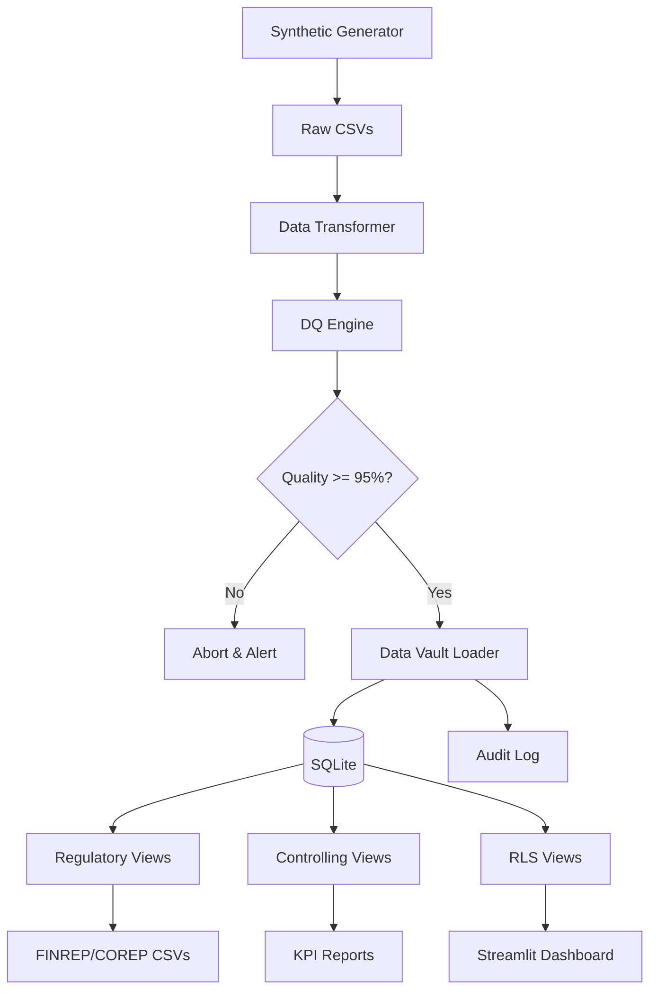

# 🏦 OpenReg: Synthetic Regulatory Reporting & Controlling Platform

[]()
[]()

A demonstration of **Data Engineering + Regulatory Reporting + Compliance** skills using synthetic banking data, Data Vault 2.0, and modern Python/SQL pipelines.

## 🎯 What This Project Proves

| Skill                    | Evidence                                                  |
| ------------------------ | --------------------------------------------------------- |
| **Regulatory Reporting** | FINREP F18, COREP CR SA, LCR, NPL ratios                  |
| **Controlling**          | Cost-center profitability, MoM growth, concentration risk |
| **Data Quality**         | Configurable DQ framework with 98% completeness threshold |
| **Row-Level Security**   | Role-based views (Regulator/Controlling/Risk)             |
| **Data Vault 2.0**       | Hubs, Links, Satellites for auditability                  |
| **ETL Pipeline**         | Python + SQLite with full logging & error handling        |
| **Audit Trail**          | `etl_audit_log` table tracks every run                    |
| **Lineage**              | Data dictionary + Mermaid diagrams                        |

## 📊 Architecture



🏃 Quick Start

```bash
# Clone repo
git clone https://github.com/yourusername/openreg.git
cd openreg

# Install dependencies
pip install -r requirements.txt

# Run full pipeline (5 minutes)

python run_pipeline.py

# Launch dashboard
streamlit run dashboard/app.py
```

## 📂 Generated Reports

| Report             | Location                    | Description                          |
| ------------------ | --------------------------- | ------------------------------------ |
| FINREP F18         | `reports/finrep/`           | Credit quality buckets by sector     |
| COREP CR SA        | `reports/corep/`            | Risk-weighted assets under Basel III |
| NPL Ratio          | `reports/kpi_npl_ratio.csv` | Key regulatory KPI                   |
| Cost Center Profit | `reports/controlling/`      | Internal profitability               |

🔍 Data Quality Results

```bash
cat data/dq_results/dq_report.csv
```

## 🔒 Row-Level Security

```sql
-- Regulator sees everything
SELECT * FROM v_loans_regulator;

-- Controlling sees only CC_1001-1003
SELECT * FROM v_loans_controlling;

-- Risk sees anonymized data
SELECT * FROM v_loans_risk;
```

## 📖 Documentation

- **[Architecture & Data Flow](./docs/architecture.md)** - High-level system design, ETL pipeline components, and data transformation processes
- **[Data Vault Model](./docs/data_vault_model.mmd)** - Detailed Data Vault 2.0 implementation with hubs, links, satellites, and point-in-time recovery
- **[Regulatory Report Definitions](./docs/regulatory_report_definitions.md)** - FINREP F18, COREP CR SA, LCR, and NPL reporting requirements with calculation formulas
- **[Controlling KPIs](./docs/kpis.md)** - Cost-center profitability metrics, efficiency ratios, and internal management accounting KPIs
- **[Security & Row-Level Security](./docs/security.md)** - Multi-role access control, data masking, encryption standards, and compliance framework
- **[Project Description Document PDF](./docs/Project%20Description%20Document.pdf)** - Comprehensive technical overview, methodology, and business case documentation

## 🎓 Learning Path

This project demonstrates exactly what banks need for regulatory reporting roles:

**Technical Skills:**

- Python programming and data manipulation (Pandas)
- SQL and database design (Data Vault 2.0)
- ETL pipeline development
- Streamlit dashboard creation

**Domain Knowledge:**

- FINREP and COREP regulatory reporting
- Basel III requirements and risk-weighted assets
- Cost center accounting and profitability analysis
- Banking compliance frameworks

**Compliance & Quality:**

- Data quality assurance (98% completeness)
- Audit trails and lineage tracking
- Row-level security implementation
- Regulatory documentation standards

## License

This project is licensed under the MIT License - see the [LICENSE](LICENSE) file for details.

## 🤝 Contributing

PRs welcome!

Focus on:

- Additional regulatory templates
- More sophisticated DQ rules
- PostgreSQL support
- Docker containerization
