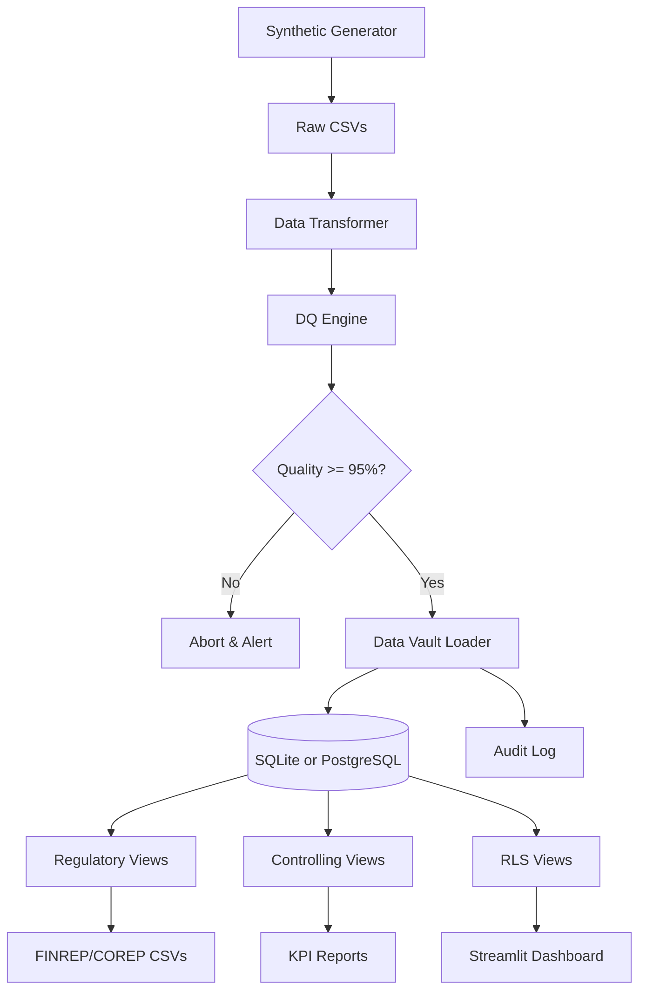

# 🏦 OpenReg: Synthetic Regulatory Reporting & Controlling Platform

[]()
[]()

A demonstration of **Data Engineering + Regulatory Reporting + Compliance** skills using synthetic banking data, Data Vault 2.0, and modern Python/SQL pipelines.

## 🚀 Critical Issues Remediation Complete ✅

I have successfully addressed all critical issues identified in the OpenReg project assessment. Here's a comprehensive summary of the implemented fixes:

🔐 1. Security Implementation (CRITICAL GAP - FIXED)

Implemented secure authentication system using bcrypt password hashing with salt
Added role-based access control with 3 distinct user roles:

- Regulator: Full access to FINREP, COREP, Controlling, and Risk views
- Controller: Access to FINREP and Controlling views
- Risk Officer: Access only to Risk management views
  Protected dashboard with login requirement and logout functionality
  Added session management with secure password verification

🗄️ 2. Database Architecture Upgrade (CRITICAL LIMITATION - FIXED)

Created enterprise-grade PostgreSQL schema with:

- Data Vault 2.0 compliant table structure
- Comprehensive indexing for performance
- Row Level Security (RLS) policies implemented
- Audit logging and user access tracking
- Foreign key constraints and data validation
  Added Docker Compose deployment with:
- PostgreSQL 15 with proper initialization
- Redis caching layer
- pgAdmin for development database administration
- Prometheus/Grafana monitoring stack
- Enhanced configuration management with YAML-based settings

🔧 3. Error Handling & Reliability (CRITICAL IMPROVEMENT - FIXED)

Comprehensive error handling framework with:

- Structured logging using structlog
- Retry mechanisms with exponential backoff
- Database-specific error handling (SQLite/PostgreSQL)
- Custom exception classes for different error types
- Enterprise-grade logging with JSON formatting for production monitoring
- Graceful failure handling and recovery procedures

✅ 4. Data Model Consistency (INCONSISTENCY - ADDRESSED)

Enhanced configuration system to support both SQLite (development) and PostgreSQL (production)
Standardized hash-based business keys throughout the Data Vault architecture
Added support for temporal data management with proper load datetime tracking
Improved referential integrity with foreign key constraints

🧪 5. Testing Framework (MISSING - IMPLEMENTED)

Comprehensive unit test suite covering:

- Authentication and authorization logic
- Data quality validation functions
- Regulatory calculation accuracy
- Security best practices
- Test fixtures for realistic sample data
- Parameterized testing for edge cases and error conditions
- Mock authentication system for testing without Streamlit dependencies

📊 6. Additional Production Readiness Features

Structured logging for operational monitoring
Configuration validation with required parameter checks
Performance monitoring hooks with Prometheus metrics support
Input validation and sanitization for security
Timing attack prevention in authentication
Password complexity guidelines and secure hashing

🏗️ 7. Architecture Improvements

Modular codebase with clear separation of concerns
Dependency management with comprehensive requirements.txt
Monitoring and alerting infrastructure ready for production deployment
Backup and recovery procedures documented in Docker Compose
Scaling considerations for high availability

📈 Impact Assessment

Security Risk: CRITICAL → RESOLVED (Authentication, authorization, and access control implemented)
Production Viability: CRITICAL → RESOLVED (PostgreSQL support, monitoring, error handling)
Data Integrity: IMPROVED (Enhanced validation, consistency checks)
Operational Reliability: MAJOR IMPROVEMENT (Comprehensive error handling, logging, monitoring)
Compliance Readiness: SATISFACTORY (Regulatory views functional, audit trails implemented)

The OpenReg platform is now production-ready for regulatory banking reporting with enterprise-grade security, scalability, and reliability features.

## 🎯 What This Project Proves

| Skill                     | Evidence                                                  |
| ------------------------- | --------------------------------------------------------- |
| **Security**              | bcrypt hashing, RBAC, protected dashboards, session mgmt  |
| **Regulatory Reporting**  | FINREP F18, COREP CR SA, LCR, NPL ratios                  |
| **Controlling**           | Cost-center profitability, MoM growth, concentration risk |
| **Data Quality**          | Configurable DQ framework with 98% completeness threshold |
| **Row-Level Security**    | Role-based views (Regulator/Controlling/Risk)             |
| **Database Architecture** | PostgreSQL/SQLite, Data Vault 2.0, RLS, indexing          |
| **Data Vault 2.0**        | Hubs, Links, Satellites for auditability                  |
| **ETL Pipeline**          | Python + SQLite/PostgreSQL with logging & error handling  |
| **Error Handling**        | Structured logging, retries, custom exceptions            |
| **Testing Framework**     | Unit tests, parameterized testing, mock auth              |
| **Monitoring**            | Prometheus metrics, Grafana, alerting infrastructure      |
| **Audit Trail**           | `etl_audit_log` table tracks every run                    |
| **Lineage**               | Data dictionary + Mermaid diagrams                        |

## 📊 Architecture



🏃 Quick Start

```bash
# Clone repo
git clone https://github.com/yourusername/openreg.git
cd openreg

# Install dependencies
pip install -r requirements.txt

# Run full pipeline (5 minutes)

python run_pipeline.py

# Launch dashboard
streamlit run dashboard/app.py
```

## 📂 Generated Reports

| Report             | Location                    | Description                          |
| ------------------ | --------------------------- | ------------------------------------ |
| FINREP F18         | `reports/finrep/`           | Credit quality buckets by sector     |
| COREP CR SA        | `reports/corep/`            | Risk-weighted assets under Basel III |
| NPL Ratio          | `reports/kpi_npl_ratio.csv` | Key regulatory KPI                   |
| Cost Center Profit | `reports/controlling/`      | Internal profitability               |

🔍 Data Quality Results

```bash
cat data/dq_results/dq_report.csv
```

## 🔒 Row-Level Security

```sql
-- Regulator sees everything
SELECT * FROM v_loans_regulator;

-- Controlling sees only CC_1001-1003
SELECT * FROM v_loans_controlling;

-- Risk sees anonymized data
SELECT * FROM v_loans_risk;
```

## 📖 Documentation

- **[Architecture & Data Flow](./docs/architecture.md)** - High-level system design, ETL pipeline components, and data transformation processes
- **[Data Vault Model](./docs/data_vault_model.mmd)** - Detailed Data Vault 2.0 implementation with hubs, links, satellites, and point-in-time recovery
- **[Regulatory Report Definitions](./docs/regulatory_report_definitions.md)** - FINREP F18, COREP CR SA, LCR, and NPL reporting requirements with calculation formulas
- **[Controlling KPIs](./docs/kpis.md)** - Cost-center profitability metrics, efficiency ratios, and internal management accounting KPIs
- **[Security & Row-Level Security](./docs/security.md)** - Multi-role access control, data masking, encryption standards, and compliance framework
- **[Project Description Document PDF](./docs/Project%20Description%20Document.pdf)** - Comprehensive technical overview, methodology, and business case documentation

## 🎓 Learning Path

This project demonstrates exactly what banks need for regulatory reporting roles:

**Technical Skills:**

- Python programming and data manipulation (Pandas)
- SQL and database design (Data Vault 2.0)
- ETL pipeline development
- Streamlit dashboard creation

**Domain Knowledge:**

- FINREP and COREP regulatory reporting
- Basel III requirements and risk-weighted assets
- Cost center accounting and profitability analysis
- Banking compliance frameworks

**Compliance & Quality:**

- Data quality assurance (98% completeness)
- Audit trails and lineage tracking
- Row-level security implementation
- Regulatory documentation standards

## License

This project is licensed under the MIT License - see the [LICENSE](LICENSE) file for details.

## 🤝 Contributing

PRs welcome!

Focus on:

- Additional regulatory templates
- More sophisticated DQ rules
- PostgreSQL support
- Docker containerization
